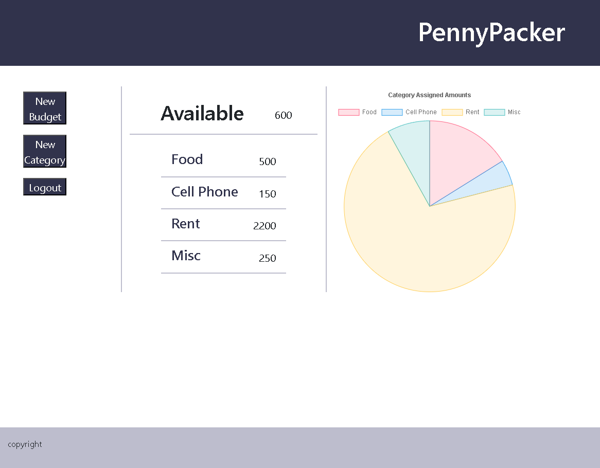
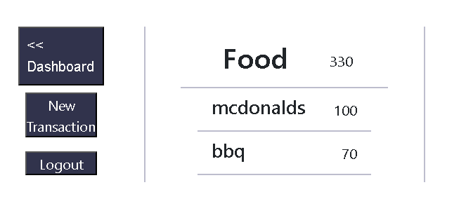

# PennyPacker

## Description

PennyPacker is a simple budgeting website that allows you to track your finances and see how much money you have available to spend.

This project was built because it's difficult to manage finances and in the current economic climate; every penny counts.

## Installation

The first thing that needs to be done is a .env file needs to be made with DB_NAME, DB_USER, DB_PASSWORD. Then, the database needs to be initialized using postgreSQL using the schema in the db file. Then, you need to run npm i in the command line to get the needed npm packages. Finally, you can run the server locally using node server.js in the command line. 

Or, if you want a more simple approach, here's our render page: (insert link here)

## Usage

In order to use PennyPacker users need to create a profile with a username and password. Once they are logged in they start by creating a new budget and adding their income. After they have their income they can start adding categories and assigning amounts to them. This will subtract the total category amounts from the available income. To add transactions they need to click on the name of the category which will take them to a new page where they can add a transaction that will be subtracted from the category's available budget.

    

## Credits

Paula Gonzalez
https://github.com/gonz951

Ben Schwendiman
https://github.com/bschwendiman90

John Shumway
https://github.com/johnnsandra

Charlie Dalton
https://github.com/8bitCharlie

## License

MIT License

Copyright (c) 2024 Paula 'Fel' Gonzalez, Ben Schwendiman, John Shumway, Charlie Dalton

Permission is hereby granted, free of charge, to any person obtaining a copy
of this software and associated documentation files (the "Software"), to deal
in the Software without restriction, including without limitation the rights
to use, copy, modify, merge, publish, distribute, sublicense, and/or sell
copies of the Software, and to permit persons to whom the Software is
furnished to do so, subject to the following conditions:

The above copyright notice and this permission notice shall be included in all
copies or substantial portions of the Software.

THE SOFTWARE IS PROVIDED "AS IS", WITHOUT WARRANTY OF ANY KIND, EXPRESS OR
IMPLIED, INCLUDING BUT NOT LIMITED TO THE WARRANTIES OF MERCHANTABILITY,
FITNESS FOR A PARTICULAR PURPOSE AND NONINFRINGEMENT. IN NO EVENT SHALL THE
AUTHORS OR COPYRIGHT HOLDERS BE LIABLE FOR ANY CLAIM, DAMAGES OR OTHER
LIABILITY, WHETHER IN AN ACTION OF CONTRACT, TORT OR OTHERWISE, ARISING FROM,
OUT OF OR IN CONNECTION WITH THE SOFTWARE OR THE USE OR OTHER DEALINGS IN THE
SOFTWARE.
